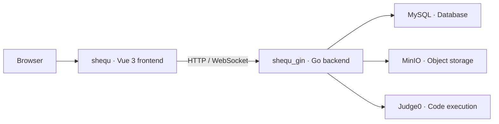

[简体中文（Chinese）](README.md) · English · [Backend repository](https://github.com/qihai-coding/shequ_gin)

# Shequ · Technical Community


A community frontend for technical writing, conversations, resource sharing and online coding. It works with the [shequ_gin backend](https://github.com/qihai-coding/shequ_gin) and provides separate page access for members and administrators.

[Features](#features) · [Architecture](#architecture) · [Quick start](#quick-start) · [Development](#development) · [Runtime notes](#runtime-notes)

## Features

| Area | Capabilities implemented in the source |
| --- | --- |
| Writing | Article editing, categories, tags, comments and likes; Markdown rendering, syntax highlighting, formulas and diagrams |
| Live conversations | Standard and danmaku chat rooms, online users, message history and connection retries |
| Messages and profiles | Conversation lists, unread messages, user profiles, avatar cropping, password changes and activity history |
| Resource sharing | Category browsing, uploads, chunked file transfers, preview images and resource comments |
| Online coding | Multi-language editor, execution output, code square, saved snippets, execution history and share links |
| Community insights | Administrator pages for cumulative, daily and realtime metrics, users, API activity and geographic distribution |

## Technology

| Layer | Libraries and responsibilities |
| --- | --- |
| Application | Vue 3, TypeScript, Vue Router and Element Plus |
| Development | Vite 7, vue-tsc, ESLint and Prettier |
| Data and communication | Axios and WebSocket |
| Authoring and visualization | Monaco Editor, markdown-it, KaTeX, Mermaid and ECharts |

See [package.json](package.json) and [package-lock.json](package-lock.json) for dependency versions.

## Architecture



This repository implements the interface and interactions. The backend handles database access, authentication, storage operations and requests to the code execution service. Serving the frontend alone does not deploy the complete system.

## Quick start

### 1. Prerequisites

- **Node.js 22.12 or later** with its bundled npm is recommended. The locked Vite 7 dependency requires `^20.19.0 || >=22.12.0`; the project's declared Node.js 18 minimum does not satisfy that dependency.
- Prepare the backend using its [setup instructions](https://github.com/qihai-coding/shequ_gin/blob/master/README.en.md#quick-start). Its default address is `http://localhost:3001`.

### 2. Install and configure

```sh
git clone https://github.com/qihai-coding/shequ.git
cd shequ
npm ci
```

Copy [env.example](env.example) to `.env.local`:

```sh
cp env.example .env.local
```

In PowerShell, `Copy-Item env.example .env.local` is also supported. Check that the following value matches your backend:

```dotenv
VITE_API_BASE_URL=http://localhost:3001/api
```

Keep a complete URL with the `/api` suffix: some existing realtime connection code parses this URL. The backend's allowed CORS origins should include `http://localhost:3000`.

### 3. Run

```sh
npm run dev
```

Open `http://localhost:3000`. Development chat connections use Vite's `/api` proxy, which targets `http://127.0.0.1:3001`. If the backend port changes, update the proxy target in [vite.config.js](vite.config.js) as well.

| Variable | Purpose |
| --- | --- |
| `VITE_API_BASE_URL` | Backend API base URL, including `/api` |
| `VITE_API_TIMEOUT` | General request timeout in milliseconds |
| `VITE_CODE_EXECUTION_TIMEOUT` | Code execution request timeout in milliseconds |
| `VITE_AMAP_KEY` | Optional AMap service key for location features |
| `VITE_APP_TITLE` / `VITE_APP_DESCRIPTION` | Application title and description |

See [env.example](env.example) and [src/config/index.ts](src/config/index.ts) for all settings. Vite injects these variables into the frontend; restart the development server or rebuild after changing them. Values prefixed with `VITE_` may be visible to browser users and must not contain server-side credentials such as database passwords.

## Development

| Command | Purpose |
| --- | --- |
| `npm run dev` | Start the development server |
| `npm run type-check` | Run type checking |
| `npm run lint:check` | Check code without automatically rewriting files |
| `npm run build` | Type-check and produce the `dist/` build |
| `npm run preview` | Preview the build locally |

A deployment needs static hosting, a frontend route fallback and backend connection configuration. The development proxy is not included in the build. HTTPS deployments also need a corresponding secure WebSocket connection.

## Project structure

```text
src/
├── views/        Articles, chat, resources, code, statistics and other pages
├── components/   Components grouped by feature
├── layouts/      Application layout
├── router/       Routes and access control
├── services/     Realtime connections, content notifications and message cache
├── utils/        API requests, authentication, transfers and helpers
├── config/       Environment configuration and constants
└── types/        Type definitions
public/          Static files
docs/assets/     Repository cover and editable vector source
```

## Runtime notes

- Member pages and administrator statistics have different access rules. Administrators are identified by the username list configured in the backend.
- Online execution depends on the backend's Judge0 service; resource features depend on MinIO. These services are not provided by the frontend.
- The current home-page content notification service uses `/api/ws`, while the companion backend registers `/api/chat/ws`. This notification path needs alignment and integration testing. The chat service already uses the latter. See the [content notification service](src/services/contentNotificationService.ts) and [chat service](src/services/globalChatService.ts).
- The cover is a feature illustration. This feature list describes the source code, not an end-to-end deployment certification or a performance or production-readiness guarantee.

## Feedback and license

Report problems or suggest improvements through [Issues](https://github.com/qihai-coding/shequ/issues), including reproduction steps, your environment and sanitized logs.

Licensed under the [MIT License](LICENSE). Copyright `2026 qihai-coding`. Third-party dependencies retain their own licenses.
