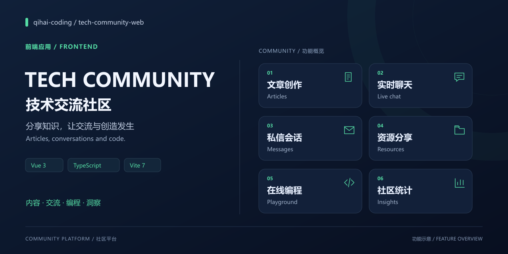
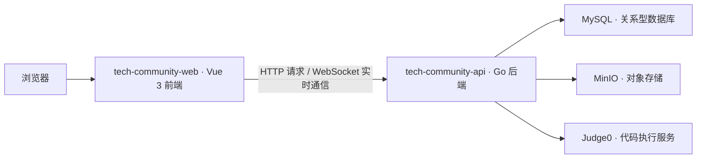

简体中文 · [English（英文）](README.en.md) · [后端仓库](https://github.com/qihai-coding/tech-community-api)

# Tech Community · 技术交流社区



面向技术交流的社区前端，将内容发布、即时交流、资源分享和在线编程整合在同一个应用中。配合 [tech-community-api 后端](https://github.com/qihai-coding/tech-community-api)运行，提供普通用户与管理员各自的页面入口。

[功能概览](#功能概览) · [系统架构](#系统架构) · [快速开始](#快速开始) · [开发与构建](#开发与构建) · [运行说明](#运行说明)

## 功能概览

| 模块 | 代码中实现的能力 |
| --- | --- |
| 内容创作 | 文章编辑、分类与标签、评论与点赞；Markdown（轻量标记语言）内容渲染、代码高亮、公式与图表 |
| 实时交流 | 普通聊天室、弹幕聊天室、在线用户、聊天历史与连接重试 |
| 私信与个人资料 | 会话列表、未读消息、用户资料、头像裁剪、密码修改与操作历史 |
| 资源分享 | 分类浏览、资源上传、文件分片传输、预览图与资源评论 |
| 在线编程 | 多语言编辑器、代码执行结果、代码广场、片段保存、执行历史与分享链接 |
| 社区统计 | 管理员页面中的累计指标、每日指标、实时指标、用户与接口统计、地区分布 |

## 技术栈

| 层次 | 技术与用途 |
| --- | --- |
| 应用界面 | Vue 3（前端框架）、TypeScript（类型化脚本语言）、Vue Router（路由管理）、Element Plus（界面组件库） |
| 开发与构建 | Vite 7（开发与构建工具）、vue-tsc（组件类型检查）、ESLint（代码检查）、Prettier（代码格式化） |
| 数据与通信 | Axios（请求客户端）、WebSocket（双向实时通信） |
| 创作与展示 | Monaco Editor（代码编辑器）、markdown-it（标记文本解析器）、KaTeX（公式排版）、Mermaid（文本绘图）、ECharts（数据图表） |

依赖版本以 [package.json](package.json) 和 [package-lock.json](package-lock.json) 为准。

## 系统架构



此仓库负责界面与交互。数据库访问、身份认证、存储操作和代码执行服务调用由后端负责；在浏览器中打开前端并不能代替完整服务部署。

## 快速开始

### 1. 准备环境

- 推荐 Node.js（脚本运行环境）**22.12 或更高版本**，以及随附的 npm（依赖管理工具）。锁文件中的 Vite 7 实际要求 `^20.19.0 || >=22.12.0`；项目声明的 Node.js 18 下限不足以满足该依赖。
- 按[后端启动说明](https://github.com/qihai-coding/tech-community-api#快速开始)准备后端，默认地址为 `http://localhost:3001`。

### 2. 安装与配置

```sh
git clone https://github.com/qihai-coding/tech-community-web.git
cd tech-community-web
npm ci
```

将 [env.example](env.example) 复制为 `.env.local`：

```sh
cp env.example .env.local
```

在 PowerShell（命令行环境）中也可使用 `Copy-Item env.example .env.local`。确认以下配置与后端一致：

```dotenv
VITE_API_BASE_URL=http://localhost:3001/api
```

此处保留完整地址及 `/api` 后缀，现有部分实时通信代码会解析该地址。后端允许的跨域来源应包含 `http://localhost:3000`。

### 3. 启动前端

```sh
npm run dev
```

打开 `http://localhost:3000`。聊天室的开发连接通过 Vite 的 `/api` 代理转发至 `http://127.0.0.1:3001`；若修改后端端口，还需同步调整 [vite.config.js](vite.config.js) 中的代理目标。

| 配置项 | 用途 |
| --- | --- |
| `VITE_API_BASE_URL` | 后端接口根地址，包含 `/api` 后缀 |
| `VITE_API_TIMEOUT` | 普通接口请求超时，单位毫秒 |
| `VITE_CODE_EXECUTION_TIMEOUT` | 代码执行请求超时，单位毫秒 |
| `VITE_AMAP_KEY` | 可选的高德地图服务密钥，用于定位相关功能 |
| `VITE_APP_TITLE` / `VITE_APP_DESCRIPTION` | 应用标题与介绍 |

完整配置见 [env.example](env.example) 与 [src/config/index.ts](src/config/index.ts)。这些变量由构建工具注入前端，修改后需重启开发服务或重新构建；带 `VITE_` 前缀的值可能对浏览器用户可见，不能放入数据库密码等服务端凭据。

## 开发与构建

| 命令 | 作用 |
| --- | --- |
| `npm run dev` | 启动开发服务 |
| `npm run type-check` | 执行类型检查 |
| `npm run lint:check` | 检查代码，不自动改写文件 |
| `npm run build` | 先检查类型，再生成 `dist/` 构建产物 |
| `npm run preview` | 在本机预览构建产物 |

发布时需要静态文件托管、前端路由回退和后端连接配置；开发代理不会随构建产物一同部署。使用加密网页连接时，还需配置对应的加密实时通信连接。

## 项目结构

```text
src/
├── views/        页面：文章、聊天、资源、代码、统计等
├── components/   按业务划分的组件
├── layouts/      应用布局
├── router/       路由与访问控制
├── services/     实时连接、内容通知与消息缓存
├── utils/        接口请求、认证、上传下载与工具函数
├── config/       环境变量读取与常量
└── types/        类型定义
public/          静态文件
docs/assets/     仓库展示封面与可编辑矢量源图
```

## 运行说明

- 普通用户页面与管理员统计页面有不同访问条件；管理员由后端配置的用户名列表识别。
- 在线执行依赖后端连接的 Judge0（代码执行服务），资源相关功能依赖 MinIO（对象存储），前端本身不提供这些服务。
- 当前首页内容通知使用 `/api/ws`，而配套后端注册的是 `/api/chat/ws`；该通知链路需对齐并联调。聊天室服务使用的是后者。参见[内容通知实现](src/services/contentNotificationService.ts)与[聊天室实现](src/services/globalChatService.ts)。
- 封面是功能示意图。功能列表依据仓库代码整理，不代表所有流程已通过完整部署验证，也不构成性能或生产可用性承诺。

## 反馈与许可

问题与改进建议请提交至 [Issues（问题反馈）](https://github.com/qihai-coding/tech-community-web/issues)，附上复现步骤、运行环境和已移除敏感信息的日志。

本项目采用 [MIT（宽松开源许可证）](LICENSE)，版权归属为 `2026 qihai-coding`。第三方依赖仍遵循各自许可证。
